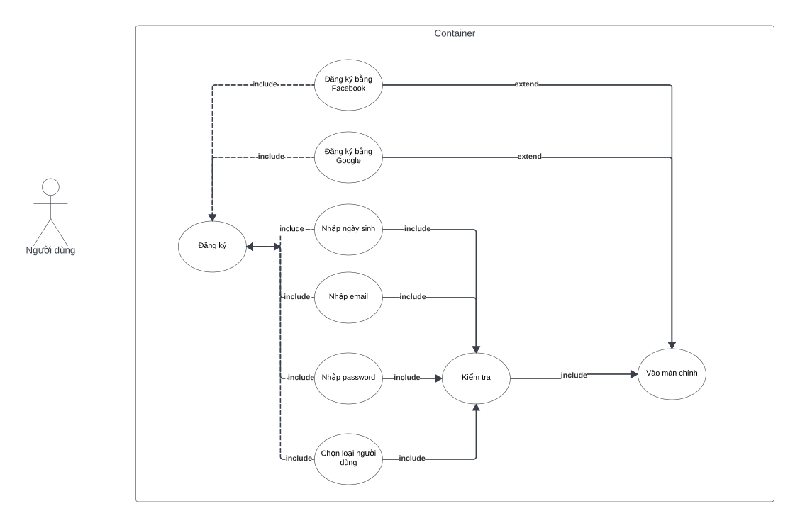
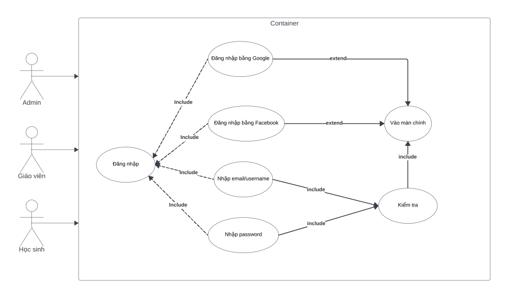

# System Operating Flow Description

1. **Màn hình chào**
   - Khi người dùng truy cập vào hệ thống, họ sẽ thấy màn hình chào.
   
2. **Màn hình đăng nhập và đăng ký**
   - Người dùng có thể lựa chọn đăng nhập hoặc đăng ký:
     - **Màn hình đăng nhập**: Nếu đã có tài khoản.
     - **Màn hình đăng ký**: Nếu chưa có tài khoản.
     
3. **Phân quyền (role)**
   - Sau khi đăng nhập, hệ thống xác định vai trò (role) của người dùng:
     - **Admin**
     - **Người dùng (giáo viên hoặc học viên)**

4. **Chức năng của Admin**
   - Admin sau khi đăng nhập sẽ được chuyển tới màn hình chính của Admin, với hai chức năng chính:
     - **Quản lý user**: Quản lý thông tin của người dùng trong hệ thống.
     - **Quản lý học phần**: Quản lý các học phần trong hệ thống.

5. **Chức năng của người dùng**
   - Người dùng (có thể là giáo viên hoặc học viên) sẽ vào màn hình chính sau khi đăng nhập, với các lựa chọn:
     - **Hồ sơ**: Xem và chỉnh sửa thông tin cá nhân.
     - **Học phần**: Quản lý hoặc đăng ký các học phần.
     - **Lớp học**: Dành riêng cho giáo viên để quản lý lớp học.
     - **Khóa học**: Tham gia các khóa học.
     - **Thành tựu**: Xem thành tích của bản thân.
     - **Thêm**: Các tính năng hoặc phần bổ sung khác.

6. **Vai trò của Giáo viên**
   - Nếu người dùng là giáo viên, họ sẽ có thêm quyền quản lý lớp học và học phần.

## 6. Example Flow: User Login

- **Login flow diagram**

## Người dùng thao tác
#### 1. Đăng nhập
   - **Mô tả**: Tất cả người dùng (Giáo viên, Học sinh, Admin) phải đăng nhập vào hệ thống để sử dụng các chức năng.
   - **Mối quan hệ**: 
     - **Include**: Đăng nhập là bước bắt buộc để truy cập các chức năng khác.
     - **Extend**: Có thể mở rộng với các chức năng khác như đăng ký, đăng xuất, đổi mật khẩu.

#### 2. Quản lý người dùng (Admin)
   - **Mô tả**: Admin quản lý thông tin và quyền hạn của người dùng trong hệ thống.
   - **tác nhân liên quan**: Admin.
   - **Mối quan hệ**: Bao gồm trong trường hợp đăng nhập.

#### 3. Quản lý lớp học (Giáo viên)
   - **Mô tả**: Giáo viên có thể tạo, quản lý các lớp học.
   - **tác nhân liên quan**: Giáo viên.
   - **Mối quan hệ**: Include trong trường hợp đăng nhập.

#### 4. Quản lý flashcards (Giáo viên)
   - **Mô tả**: Giáo viên có thể tạo và quản lý các bộ flashcards phục vụ học tập.
   - **tác nhân liên quan**: Giáo viên.
   - **Mối quan hệ**: Include trong trường hợp đăng nhập.

#### 5. Quản lý thư mục (Giáo viên)
   - **Mô tả**: Giáo viên có thể tạo và quản lý thư mục chứa flashcards hoặc tài liệu học tập.
   - **tác nhân liên quan**: Giáo viên.
   - **Mối quan hệ**: Include trong trường hợp đăng nhập.

#### 6. Tạo flashcards (Giáo viên)
   - **Mô tả**: Giáo viên có thể tạo flashcards mới để học sinh sử dụng.
   - **tác nhân liên quan**: Giáo viên.
   - **Mối quan hệ**: Include trong trường hợp đăng nhập.

#### 7. Tạo thư mục (Giáo viên)
   - **Mô tả**: Giáo viên có thể tạo thư mục để lưu trữ flashcards hoặc tài liệu khác.
   - **tác nhân liên quan**: Giáo viên.
   - **Mối quan hệ**: Include trong trường hợp đăng nhập.

#### 8. Tạo lớp học (Giáo viên)
   - **Mô tả**: Giáo viên có thể tạo lớp học và thêm học sinh vào lớp.
   - **tác nhân liên quan**: Giáo viên.
   - **Mối quan hệ**: Include trong trường hợp đăng nhập.

#### 9. Hiển thị flashcards, thư mục (Học sinh)
   - **Mô tả**: Học sinh có thể xem flashcards và thư mục do giáo viên tạo.
   - **tác nhân liên quan**: Học sinh.
   - **Mối quan hệ**: Include trong trường hợp đăng nhập.

#### 10. Hồ sơ tài khoản (Học sinh)
   - **Mô tả**: Học sinh có thể xem và chỉnh sửa thông tin tài khoản cá nhân.
   - **tác nhân liên quan**: Học sinh.
   - **Mối quan hệ**: Include trong trường hợp đăng nhập.

#### 11. Thư viện (Học sinh)
   - **Mô tả**: Học sinh có thể truy cập thư viện tài liệu học tập.
   - **tác nhân liên quan**: Học sinh.
   - **Mối quan hệ**: Include trong trường hợp đăng nhập.

#### 12. Đăng ký
   - **Mô tả**: Người dùng có thể đăng ký tài khoản mới nếu chưa có.
   - **tác nhân liên quan**: Tất cả người dùng.
   - **Mối quan hệ**: Extend từ trường hợp đăng nhập.

#### 13. Đăng xuất
   - **Mô tả**: Người dùng có thể đăng xuất khỏi hệ thống.
   - **tác nhân liên quan**: Tất cả người dùng.
   - **Mối quan hệ**: Extend từ trường hợp đăng nhập.

#### 14. Đổi mật khẩu
   - **Mô tả**: Người dùng có thể thay đổi mật khẩu khi cần thiết.
   - **tác nhân liên quan**: Tất cả người dùng.
   - **Mối quan hệ**: Extend từ trường hợp đăng nhập.

